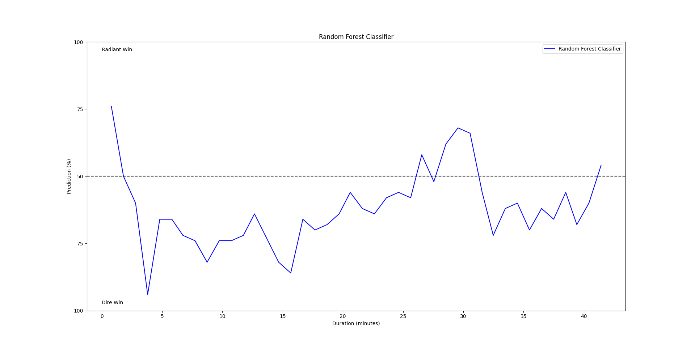
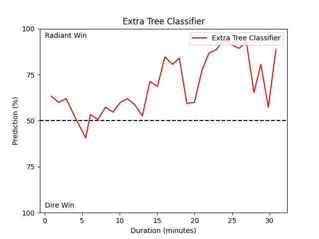
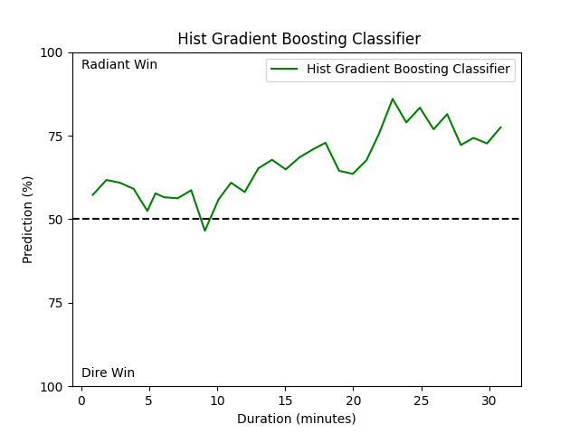

# Applying Decision tree models to solve real-life problems

## Understanding Decision Tree Models: Theory and Methodology.
- [CART](part_1/CART.md)
- [ID3](part_1/ID3.md)
- [Regression](part_1/Regression.md)
- [С45](part_1/С45.md)
- [Random Forest](part_1/Random%20Forest.md)
- [CHAID](part_1/CHAID.md)
- [Gradient Boosting](part_1/Gradient%20Boosting.md)
- [Adaboost](part_1/Adaboost.md)

## Implementing a Universal Decision Tree Framework and Experimental Validation.
- [Annual Profit](part_2/Annual%20Profit/models.ipynb)
- [Breast Cancer](part_2/Breast%20Cancer/models.ipynb)
- [Contraceptive Method Choice](part_2/Contraceptive%20Method%20Choice/models.ipynb)
- [Credit Approval](part_2/Credit%20Approval/models.ipynb)
- [Energy Efficency](part_2/Energy%20Efficency/models.ipynb)
- [Glass Identification](part_2/Glass%20Identification/models.ipynb)
- [Ionosphere](part_2/Ionosphere/models.ipynb)
- [Iris Plants](part_2/Iris%20Plants/models.ipynb)
- [Nursery](part_2/Nursery/models.ipynb)
- [Spam](part_2/Spam/models.ipynb)
- [Zoo](part_2/Zoo/models.ipynb)

| Data                 | CART   | C4.5     | Extra Trees Classifier | Gradient Boosting | Hist Gradient Boosting | Random Forest | Adaboost |
| -------------------- | ------ | -------- | ---------------------- | ----------------- | ---------------------- | ------------- | -------- |
| Annual Profit        | 81.6   | 81.3     | 85.5                   | 87.3              | 87.4                   | 86.4          | 86.9     |
| Breast Cancer        | 93.4   | 92.7     | 96.4                   | 95.6              | 94.9                   | 94.9          | 95.6     |
| Credit Approval      | 87.8   | 78.6     | 87.8                   | 91.6              | 89.3                   | 90.0          | 90.8     |
| Energy Efficiency    | 98.7   | 98.0     | 99.4                   | 98.7              | 98.7                   | 99.4          | 84.4     |
| Glass Identification | 69.8   | 72.1     | 79.1                   | 72.1              | 72.1                   | 76.7          | 67.4     |
| Ionosphere           | 87.1   | 90.0     | 95.7                   | 95.7              | 94.3                   | 95.7          | 97.1     |
| Iris Plants          | 96.7   | 96.7     | 96.7                   | 100.0             | 96.7                   | 96.7          | 96.7     |
| Nursery              | 99.5   | 99.4     | 97.8                   | 100.0             | 98.5                   | 98.4          | 87.9     |
| Spam                 | 90.4   | 92.2     | 95.7                   | 95.7              | 95.2                   | 95.5          | 94.8     |
| Zoo                  | 95.0   | 95.0     | 100.0                  | 95.0              | 100.0                  | 100.0         | 95.0     |
|                      | **90** | **89.6** | **93.4**               | **85.6**          | **92.7**               | **93.3**      | **89.6** |

## Exploring Open Dota API and Steam API for Data Acquisition.
- [Open Dota API](part_3/Open%20Dota%20API/open_dota_api.md)
- [Steam API](part_3/Steam%20API/steam_api.md)

## Implementing Data Miners for Real-Time Data Acquisition

### Miners For Public Matches

[`RealtimeStats.py`](part_4/Miners/Steam/RealtimeStats.py)

This Python script continuously fetches real-time statistics for top live Dota 2 games from the Dota 2 API and stores them in a MongoDB collection for further analysis.

[`GetWinImportToDB.py`](part_4/Miners/Steam/GetWinImportToDB.py)

This Python script retrieves match details for unprocessed matches stored in a MongoDB collection and updates the collection with the winning team information.

### Miners For League Matches

[`LiveLeagueGames.py`](part_4/Miners/Steam/LiveLeagueGames.py)

This script continuously fetches live league games data from the Dota 2 API and stores them in a MongoDB collection for real-time analysis.

[`GetLeagueWin.py`](part_4/Miners/Steam/GetLeagueWin.py)

This Python script retrieves match details from the Dota 2 API for matches stored in a MongoDB collection. It iterates through unprocessed match IDs, retrieves match details, and updates the database with the winning team information.

## Training Models (Public Matches)

This section presents the performance of various decision tree-based models trained on different sizes of public match datasets.

### Notebooks

- [1k samples](part_5/1000/decision_trees.ipynb)
- [15k samples](part_5/15k/all_game_times/decision_trees.ipynb)
- [20k samples](part_5/20k/all_game_times/decision_trees.ipynb)
- [30k samples](part_5/30k/decision_trees.ipynb)
- [40k samples](part_5/40k/decision_trees.ipynb)

Selected Features: 313

timestamp,game_time,score,net_worth,team_2_player_0_heroid,team_2_player_0_level,team_2_player_0_kill_count,team_2_player_0_death_count,team_2_player_0_assists_count,team_2_player_0_denies_count,team_2_player_0_lh_count,team_2_player_0_gold,team_2_player_0_net_worth,team_2_player_0_item_0,team_2_player_0_item_1,team_2_player_0_item_2,team_2_player_0_item_3,team_2_player_0_item_4,team_2_player_0_item_5,team_2_player_0_item_6,team_2_player_0_item_7,team_2_player_0_item_8,team_2_player_1_heroid,team_2_player_1_level,team_2_player_1_kill_count,team_2_player_1_death_count,team_2_player_1_assists_count,team_2_player_1_denies_count,team_2_player_1_lh_count,team_2_player_1_gold,team_2_player_1_net_worth,team_2_player_1_item_0,team_2_player_1_item_1,team_2_player_1_item_2,team_2_player_1_item_3,team_2_player_1_item_4,team_2_player_1_item_5,team_2_player_1_item_6,team_2_player_1_item_7,team_2_player_1_item_8,team_2_player_2_heroid,team_2_player_2_level,team_2_player_2_kill_count,team_2_player_2_death_count,team_2_player_2_assists_count,team_2_player_2_denies_count,team_2_player_2_lh_count,team_2_player_2_gold,team_2_player_2_net_worth,team_2_player_2_item_0,team_2_player_2_item_1,team_2_player_2_item_2,team_2_player_2_item_3,team_2_player_2_item_4,team_2_player_2_item_5,team_2_player_2_item_6,team_2_player_2_item_7,team_2_player_2_item_8,team_2_player_3_heroid,team_2_player_3_level,team_2_player_3_kill_count,team_2_player_3_death_count,team_2_player_3_assists_count,team_2_player_3_denies_count,team_2_player_3_lh_count,team_2_player_3_gold,team_2_player_3_net_worth,team_2_player_3_item_0,team_2_player_3_item_1,team_2_player_3_item_2,team_2_player_3_item_3,team_2_player_3_item_4,team_2_player_3_item_5,team_2_player_3_item_6,team_2_player_3_item_7,team_2_player_3_item_8,team_2_player_4_heroid,team_2_player_4_level,team_2_player_4_kill_count,team_2_player_4_death_count,team_2_player_4_assists_count,team_2_player_4_denies_count,team_2_player_4_lh_count,team_2_player_4_gold,team_2_player_4_net_worth,team_2_player_4_item_0,team_2_player_4_item_1,team_2_player_4_item_2,team_2_player_4_item_3,team_2_player_4_item_4,team_2_player_4_item_5,team_2_player_4_item_6,team_2_player_4_item_7,team_2_player_4_item_8,team_3_player_0_heroid,team_3_player_0_level,team_3_player_0_kill_count,team_3_player_0_death_count,team_3_player_0_assists_count,team_3_player_0_denies_count,team_3_player_0_lh_count,team_3_player_0_gold,team_3_player_0_net_worth,team_3_player_0_item_0,team_3_player_0_item_1,team_3_player_0_item_2,team_3_player_0_item_3,team_3_player_0_item_4,team_3_player_0_item_5,team_3_player_0_item_6,team_3_player_0_item_7,team_3_player_0_item_8,team_3_player_1_heroid,team_3_player_1_level,team_3_player_1_kill_count,team_3_player_1_death_count,team_3_player_1_assists_count,team_3_player_1_denies_count,team_3_player_1_lh_count,team_3_player_1_gold,team_3_player_1_net_worth,team_3_player_1_item_0,team_3_player_1_item_1,team_3_player_1_item_2,team_3_player_1_item_3,team_3_player_1_item_4,team_3_player_1_item_5,team_3_player_1_item_6,team_3_player_1_item_7,team_3_player_1_item_8,team_3_player_2_heroid,team_3_player_2_level,team_3_player_2_kill_count,team_3_player_2_death_count,team_3_player_2_assists_count,team_3_player_2_denies_count,team_3_player_2_lh_count,team_3_player_2_gold,team_3_player_2_net_worth,team_3_player_2_item_0,team_3_player_2_item_1,team_3_player_2_item_2,team_3_player_2_item_3,team_3_player_2_item_4,team_3_player_2_item_5,team_3_player_2_item_6,team_3_player_2_item_7,team_3_player_2_item_8,team_3_player_3_heroid,team_3_player_3_level,team_3_player_3_kill_count,team_3_player_3_death_count,team_3_player_3_assists_count,team_3_player_3_denies_count,team_3_player_3_lh_count,team_3_player_3_gold,team_3_player_3_net_worth,team_3_player_3_item_0,team_3_player_3_item_1,team_3_player_3_item_2,team_3_player_3_item_3,team_3_player_3_item_4,team_3_player_3_item_5,team_3_player_3_item_6,team_3_player_3_item_7,team_3_player_3_item_8,team_3_player_4_heroid,team_3_player_4_level,team_3_player_4_kill_count,team_3_player_4_death_count,team_3_player_4_assists_count,team_3_player_4_denies_count,team_3_player_4_lh_count,team_3_player_4_gold,team_3_player_4_net_worth,team_3_player_4_item_0,team_3_player_4_item_1,team_3_player_4_item_2,team_3_player_4_item_3,team_3_player_4_item_4,team_3_player_4_item_5,team_3_player_4_item_6,team_3_player_4_item_7,team_3_player_4_item_8,graph_gold_0,graph_gold_1,graph_gold_2,graph_gold_3,graph_gold_4,graph_gold_5,graph_gold_6,graph_gold_7,graph_gold_8,graph_gold_9,graph_gold_10,graph_gold_11,graph_gold_12,graph_gold_13,graph_gold_14,graph_gold_15,graph_gold_16,graph_gold_17,graph_gold_18,graph_gold_19,graph_gold_20,graph_gold_21,graph_gold_22,graph_gold_23,graph_gold_24,graph_gold_25,graph_gold_26,graph_gold_27,graph_gold_28,graph_gold_29,graph_gold_30,graph_gold_31,graph_gold_32,graph_gold_33,graph_gold_34,graph_gold_35,graph_gold_36,graph_gold_37,graph_gold_38,graph_gold_39,graph_gold_40,graph_gold_41,graph_gold_42,graph_gold_43,graph_gold_44,graph_gold_45,graph_gold_46,graph_gold_47,graph_gold_48,graph_gold_49,graph_gold_50,graph_gold_51,graph_gold_52,graph_gold_53,graph_gold_54,graph_gold_55,graph_gold_56,graph_gold_57,graph_gold_58,graph_gold_59,graph_gold_60,graph_gold_61,graph_gold_62,graph_gold_63,graph_gold_64,graph_gold_65,graph_gold_66,graph_gold_67,graph_gold_68,graph_gold_69,graph_gold_70,graph_gold_71,graph_gold_72,graph_gold_73,graph_gold_74,graph_gold_75,graph_gold_76,graph_gold_77,graph_gold_78,graph_gold_79,graph_gold_80,graph_gold_81,graph_gold_82,graph_gold_83,graph_gold_84,graph_gold_85,graph_gold_86,graph_gold_87,graph_gold_88,graph_gold_89,graph_gold_90,graph_gold_91,graph_gold_92,graph_gold_93,graph_gold_94,graph_gold_95,graph_gold_96,graph_gold_97,graph_gold_98,graph_gold_99,graph_gold_100,graph_gold_101,graph_gold_102,graph_gold_103,graph_gold_104,graph_gold_105,graph_gold_106,graph_gold_107,graph_gold_108,graph_gold_109,graph_gold_110,graph_gold_111,graph_gold_112,graph_gold_113,graph_gold_114,graph_gold_115,graph_gold_116,graph_gold_117,graph_gold_118,graph_gold_119,graph_gold_120,graph_gold_121,graph_gold_122,graph_gold_123,graph_gold_124,graph_gold_125,graph_gold_126,graph_gold_127,winner

### Model Performance

| Data         | CART | C4.5 | Extra Trees Classifier | Gradient Boosting | Hist Gradient Boosting | Random Forest | Adaboost |
| ------------ | ---- | ---- | ---------------------- | ----------------- | ---------------------- | ------------- | -------- |
| ~1k samples  | 65.6 | 61.4 | 66.6                   | 64.5              | 71.8                   | 71.8          | 66.6     |
| ~15k samples | 89.7 | 89.5 | 93.0                   | 93.6              | 98.7                   | 91.3          | 72.3     |
| ~20k samples | 77.6 | 76.5 | 85.8                   | 83.1              | 89.1                   | 83.2          | 70.6     |
| ~30k samples | 75.8 | 75.8 | 85.2                   | 81.2              | 87.9                   | 81.1          | 69.3     |
| ~40k samples | 75.1 | 74.7 | 85.4                   | 82.1              | 88.0                   | 81.7          | 70.6     |

## Training Models (League Matches)

- [20k samples](part_6/20k/decision_trees.ipynb)
- [50k samples](part_6/53k/model_scores.txt)
- [100k samples](part_6/100k/model_scores.txt)

Selected Features: 158

duration
radiant_series_wins
dire_series_wins
score
tower_state
barracks_state
radiant_player_{i}_kills
radiant_player_{i}_death
radiant_player_{i}_assists
radiant_player_{i}_last_hits
radiant_player_{i}_gold
radiant_player_{i}_level
radiant_player_{i}_gold_per_min
radiant_player_{i}_xp_per_min
radiant_player_{i}_item0
radiant_player_{i}_item1
radiant_player_{i}_item2
radiant_player_{i}_item3
radiant_player_{i}_item4
radiant_player_{i}_item5
radiant_player_{i}_net_worth
dire_player_{i}_death
dire_player_{i}_kills
dire_player_{i}_assists
dire_player_{i}_last_hits
dire_player_{i}_gold
dire_player_{i}_level
dire_player_{i}_gold_per_min
dire_player_{i}_xp_per_min
dire_player_{i}_item0
dire_player_{i}_item1
dire_player_{i}_item2
dire_player_{i}_item3
dire_player_{i}_item4
dire_player_{i}_item5
dire_player_{i}_net_worth
net_worth
winner

### Model Performance

| Data          | CART | C4.5 | Extra Trees Classifier | Gradient Boosting | Hist Gradient Boosting | Random Forest | Adaboost |
| ------------- | ---- | ---- | ---------------------- | ----------------- | ---------------------- | ------------- | -------- |
| ~20k samples  | 84.1 | 83.6 | **96.4**               | 89.6              | 94.6                   | 94.6          | 71.6     |
| ~53k samples  | 79.6 | 79.9 | **96.0**               | 81.6              | 86.7                   | 92.7          | 67.8     |
| ~100k samples | 81.9 | 81.9 | **95.7**               | 76.4              | 81.6                   | 93.3          | 61.2     |

## Training and Evaluation on League Match Data with Match Duration Segmentation (<10min, 10-20min, >20min)

- [`create_csv.py`](part_7/create_csv.py)
- [`train.py`](part_7/train.py)

Selected Features: 186

duration,0_rts,1_rts,2_rts,3_rts,4_rts,5_rts,6_rts,7_rts,8_rts,9_rts,10_rts,0_dts,1_dts,2_dts,3_dts,4_dts,5_dts,6_dts,7_dts,8_dts,9_dts,10_dts,0_rbs,1_rbs,2_rbs,3_rbs,4_rbs,5_rbs,0_dbs,1_dbs,2_dbs,3_dbs,4_dbs,5_dbs,radiant_player_0_kills,radiant_player_0_death,radiant_player_0_assists,radiant_player_0_last_hits,radiant_player_0_gold,radiant_player_0_level,radiant_player_0_gold_per_min,radiant_player_0_xp_per_min,radiant_player_0_net_worth,radiant_player_0_item0,radiant_player_0_item1,radiant_player_0_item2,radiant_player_0_item3,radiant_player_0_item4,radiant_player_0_item5,radiant_player_1_kills,radiant_player_1_death,radiant_player_1_assists,radiant_player_1_last_hits,radiant_player_1_gold,radiant_player_1_level,radiant_player_1_gold_per_min,radiant_player_1_xp_per_min,radiant_player_1_net_worth,radiant_player_1_item0,radiant_player_1_item1,radiant_player_1_item2,radiant_player_1_item3,radiant_player_1_item4,radiant_player_1_item5,radiant_player_2_kills,radiant_player_2_death,radiant_player_2_assists,radiant_player_2_last_hits,radiant_player_2_gold,radiant_player_2_level,radiant_player_2_gold_per_min,radiant_player_2_xp_per_min,radiant_player_2_net_worth,radiant_player_2_item0,radiant_player_2_item1,radiant_player_2_item2,radiant_player_2_item3,radiant_player_2_item4,radiant_player_2_item5,radiant_player_3_kills,radiant_player_3_death,radiant_player_3_assists,radiant_player_3_last_hits,radiant_player_3_gold,radiant_player_3_level,radiant_player_3_gold_per_min,radiant_player_3_xp_per_min,radiant_player_3_net_worth,radiant_player_3_item0,radiant_player_3_item1,radiant_player_3_item2,radiant_player_3_item3,radiant_player_3_item4,radiant_player_3_item5,radiant_player_4_kills,radiant_player_4_death,radiant_player_4_assists,radiant_player_4_last_hits,radiant_player_4_gold,radiant_player_4_level,radiant_player_4_gold_per_min,radiant_player_4_xp_per_min,radiant_player_4_net_worth,radiant_player_4_item0,radiant_player_4_item1,radiant_player_4_item2,radiant_player_4_item3,radiant_player_4_item4,radiant_player_4_item5,dire_player_0_kills,dire_player_0_death,dire_player_0_assists,dire_player_0_last_hits,dire_player_0_gold,dire_player_0_level,dire_player_0_gold_per_min,dire_player_0_xp_per_min,dire_player_0_net_worth,dire_player_0_item0,dire_player_0_item1,dire_player_0_item2,dire_player_0_item3,dire_player_0_item4,dire_player_0_item5,dire_player_1_kills,dire_player_1_death,dire_player_1_assists,dire_player_1_last_hits,dire_player_1_gold,dire_player_1_level,dire_player_1_gold_per_min,dire_player_1_xp_per_min,dire_player_1_net_worth,dire_player_1_item0,dire_player_1_item1,dire_player_1_item2,dire_player_1_item3,dire_player_1_item4,dire_player_1_item5,dire_player_2_kills,dire_player_2_death,dire_player_2_assists,dire_player_2_last_hits,dire_player_2_gold,dire_player_2_level,dire_player_2_gold_per_min,dire_player_2_xp_per_min,dire_player_2_net_worth,dire_player_2_item0,dire_player_2_item1,dire_player_2_item2,dire_player_2_item3,dire_player_2_item4,dire_player_2_item5,dire_player_3_kills,dire_player_3_death,dire_player_3_assists,dire_player_3_last_hits,dire_player_3_gold,dire_player_3_level,dire_player_3_gold_per_min,dire_player_3_xp_per_min,dire_player_3_net_worth,dire_player_3_item0,dire_player_3_item1,dire_player_3_item2,dire_player_3_item3,dire_player_3_item4,dire_player_3_item5,dire_player_4_kills,dire_player_4_death,dire_player_4_assists,dire_player_4_last_hits,dire_player_4_gold,dire_player_4_level,dire_player_4_gold_per_min,dire_player_4_xp_per_min,dire_player_4_net_worth,dire_player_4_item0,dire_player_4_item1,dire_player_4_item2,dire_player_4_item3,dire_player_4_item4,dire_player_4_item5,winner

| Data                    | CART | C4.5 | Extra Trees Classifier | Gradient Boosting | Hist Gradient Boosting | Random Forest | Adaboost |
| ----------------------- | ---- | ---- | ---------------------- | ----------------- | ---------------------- | ------------- | -------- |
| ~38k samples (<10min)   | 68.6 | 70.2 | **91.4**               | 72.5              | 79.9                   | 85.6          | 62.7     |
| ~33k samples (10-20min) | 81.9 | 82.1 | **97.3**               | 83.0              | 90.0                   | 96.1          | 66.4     |
| ~42k samples (>20min)   | 92.5 | 91.9 | **98.6**               | 90.8              | 96.1                   | 98.6          | 67.8     |

## Feature Reduction and Model Improvement

- [`create_csv.py`](part_8/create_csv.py)
- [`train.py`](part_8/train.py)

Selected Features: 46

Match Duration
Tower States
Barracks States
Team Differences in Key Statistics

duration,radiant_series_wins,dire_series_wins,score,0_rts,1_rts,2_rts,3_rts,4_rts,5_rts,6_rts,7_rts,8_rts,9_rts,10_rts,0_dts,1_dts,2_dts,3_dts,4_dts,5_dts,6_dts,7_dts,8_dts,9_dts,10_dts,0_rbs,1_rbs,2_rbs,3_rbs,4_rbs,5_rbs,0_dbs,1_dbs,2_dbs,3_dbs,4_dbs,5_dbs,net_worth,assissts,last_hits,gold,level,gpm,xpm,winner

### 30k-40k samples

| Data                    | CART | C4.5 | Extra Trees Classifier | Gradient Boosting | Hist Gradient Boosting | Random Forest | Adaboost |
| ----------------------- | ---- | ---- | ---------------------- | ----------------- | ---------------------- | ------------- | -------- |
| ~39k samples (<10min)   | 58.2 | 57.8 | **65.7**               | 63.2              | 64.5                   | 63.7          | 64.3     |
| ~33k samples (10-20min) | 66.8 | 67.2 | **79.9**               | 71.8              | 72.9                   | 76.2          | 69.9     |
| ~42k samples (>20min)   | 77.5 | 78.6 | **91.1**               | 77.5              | 80.7                   | 86.6          | 72.2     |

### 47k-63k samples

| Data                    | CART | C4.5 | Extra Trees Classifier | Gradient Boosting | Hist Gradient Boosting | Random Forest | Adaboost |
| ----------------------- | ---- | ---- | ---------------------- | ----------------- | ---------------------- | ------------- | -------- |
| ~56k samples (<10min)   | 58.1 | 58.3 | **64.6**               | 63.4              | 64.5                   | 64.4          | 63.9     |
| ~48k samples (10-20min) | 65.1 | 66.3 | **78.1**               | 69.6              | 72.6                   | 75.4          | 70.3     |
| ~63k samples (>20min)   | 76.9 | 77.3 | **90.8**               | 75.8              | 78.6                   | 85.3          | 72.1     |

### 72k-98k samples

| Data                    | CART | C4.5 | Extra Trees Classifier | Gradient Boosting | Hist Gradient Boosting | Random Forest | Adaboost |
| ----------------------- | ---- | ---- | ---------------------- | ----------------- | ---------------------- | ------------- | -------- |
| ~83k samples (<10min)   | 57.2 | 56.7 | **64.3**               | 63.6              | 64.5                   | 63.9          | 64.4     |
| ~72k samples (10-20min) | 65.0 | 64.8 | **77.4**               | 70.8              | 71.6                   | 75.0          | 70.5     |
| ~98k samples (>20min)   | 74.8 | 74.5 | **89.6**               | 75.2              | 77.3                   | 84.7          | 72.8     |

## Match Analysis with Hero and Item Embeddings

- [hero embedding](part_9_embedding/heroes/train_winners.py)
- [item embedding](part_9_embedding/items/train.py)

Selected Features: 50

duration,radiant_series_wins,dire_series_wins,score,0_rts,1_rts,2_rts,3_rts,4_rts,5_rts,6_rts,7_rts,8_rts,9_rts,10_rts,0_dts,1_dts,2_dts,3_dts,4_dts,5_dts,6_dts,7_dts,8_dts,9_dts,10_dts,0_rbs,1_rbs,2_rbs,3_rbs,4_rbs,5_rbs,0_dbs,1_dbs,2_dbs,3_dbs,4_dbs,5_dbs,radiant_item_embeddings,dire_item_embeddings,radiant_embeddings,dire_embeddings,net_worth,assissts,last_hits,gold,level,gpm,xpm,winner

### Without Shuffle of Hero Embeddings

| Data                    | CART | C4.5 | Extra Trees Classifier | Gradient Boosting | Hist Gradient Boosting | Random Forest | Adaboost |
| ----------------------- | ---- | ---- | ---------------------- | ----------------- | ---------------------- | ------------- | -------- |
| ~83k samples (<10min)   | 72.3 | 72.2 | **94.6**               | 77.7              | 85.5                   | 84.4          | 63.8     |
| ~72k samples (10-20min) | 87.4 | 88.6 | **94.1**               | 83.6              | 88.5                   | 93.0          | 70.3     |
| ~98k samples (>20min)   | 92.8 | 93.3 | **97.9**               | 88.2              | 93.2                   | 97.6          | 72.5     |

### With Shuffle of Hero Embeddings

| Data                    | CART | C4.5 | Extra Trees Classifier | Gradient Boosting | Hist Gradient Boosting | Random Forest | Adaboost |
| ----------------------- | ---- | ---- | ---------------------- | ----------------- | ---------------------- | ------------- | -------- |
| ~83k samples (<10min)   | 58.0 | 57.9 | **65.1**               | 63.6              | 64.9                   | 63.9          | 63.8     |
| ~72k samples (10-20min) | 64.6 | 64.0 | **74.0**               | 70.4              | 71.8                   | 72.4          | 69.8     |
| ~98k samples (>20min)   | 72.5 | 71.7 | **85.2**               | 76.3              | 77.8                   | 80.7          | 72.6     |

### With Shuffle of Winner Hero Embeddings

| Data                    | CART | C4.5 | Extra Trees Classifier | Gradient Boosting | Hist Gradient Boosting | Random Forest | Adaboost |
| ----------------------- | ---- | ---- | ---------------------- | ----------------- | ---------------------- | ------------- | -------- |
| ~83k samples (<10min)   | 57.6 | 58.0 | **65.7**               | 64.1              | 65.3                   | 64.5          | 64.0     |
| ~72k samples (10-20min) | 64.3 | 64.5 | **75.7**               | 70.5              | 71.8                   | 73.4          | 69.8     |
| ~98k samples (>20min)   | 72.1 | 71.7 | **86.3**               | 76.0              | 77.7                   | 81.0          | 72.6     |

### With Mean of Winner Hero Embeddings

| Data                    | CART | C4.5 | Extra Trees Classifier | Gradient Boosting | Hist Gradient Boosting | Random Forest | Adaboost |
| ----------------------- | ---- | ---- | ---------------------- | ----------------- | ---------------------- | ------------- | -------- |
| ~83k samples (<10min)   | 62.0 | 61.3 | **68.6**               | 70.2              | 73.1                   | 68.0          | 63.8     |
| ~72k samples (10-20min) | 75.2 | 75.7 | **81.8**               | 76.8              | 78.1                   | 79.6          | 70.3     |
| ~98k samples (>20min)   | 83.7 | 85.5 | **93.3**               | 82.3              | 84.4                   | 89.9          | 72.5     |

### Hero Embeddings (Mean) + Item Embeddings (Mean)

| Data                    | CART | C4.5 | Extra Trees Classifier | Gradient Boosting | Hist Gradient Boosting | Random Forest | Adaboost |
| ----------------------- | ---- | ---- | ---------------------- | ----------------- | ---------------------- | ------------- | -------- |
| ~83k samples (<10min)   | 60.7 | 62.5 | **69.4**               | 71.4              | 72.6                   | 68.6          | 64.5     |
| ~72k samples (10-20min) | 73.8 | 74.0 | **83.2**               | 77.3              | 78.4                   | 79.9          | 70.9     |
| ~98k samples (>20min)   | 83.0 | 84.0 | **93.2**               | 82.7              | 84.4                   | 89.8          | 71.7     |

### Hero Embeddings (Mean) + Item Embeddings (Mean) + more samples

| Data                    | CART | C4.5 | Extra Trees Classifier | Gradient Boosting | Hist Gradient Boosting | Random Forest | Adaboost |
| ----------------------- | ---- | ---- | ---------------------- | ----------------- | ---------------------- | ------------- | -------- |
| ~96k samples (<10min)   | 60.9 | 61.5 | **68.5**               | 70.2              | 71.6                   | 67.6          | 64.6     |
| ~85k samples (10-20min) | 73.8 | 76.5 | **82.4**               | 75.7              | 76.9                   | 80.0          | 71.0     |
| ~116k samples (>20min)  | 83.9 | 83.5 | **93.3**               | 81.8              | 83.1                   | 90.3          | 72.8     |

### Hero Embeddings (Mean) + Item Embeddings (separate for each item, 108 features) + more samples

| Data                    | CART | C4.5 | Extra Trees Classifier | Gradient Boosting | Hist Gradient Boosting | Random Forest | Adaboost |
| ----------------------- | ---- | ---- | ---------------------- | ----------------- | ---------------------- | ------------- | -------- |
| ~96k samples (<10min)   | 59.2 | 58.9 | **64.6**               | 69.2              | 70.0                   | 64.3          | 64.4     |
| ~85k samples (10-20min) | 67.8 | 68.8 | **72.1**               | 75.3              | 74.7                   | 70.9          | 70.3     |
| ~116k samples (>20min)  | 77.1 | 78.5 | **81.3**               | 82.0              | 82.2                   | 78.1          | 73.0     |

### Without embeddings

| Data                    | CART | C4.5 | Extra Trees Classifier | Gradient Boosting | Hist Gradient Boosting | Random Forest | Adaboost |
| ----------------------- | ---- | ---- | ---------------------- | ----------------- | ---------------------- | ------------- | -------- |
| ~96k samples (<10min)   | 57.7 | 57.7 | **64.7**               | 64.3              | 65.0                   | 64.0          | 64.6     |
| ~85k samples (10-20min) | 65.2 | 65.7 | **76.9**               | 70.7              | 71.9                   | 74.8          | 71.0     |
| ~116k samples (>20min)  | 75.7 | 74.9 | **89.6**               | 76.1              | 77.7                   | 85.0          | 72.8     |

## Enhancing Predictive Models with Dotabuff Data: Hero and Item Winrate Features

- [Scraping hero winrates](part_10_generate_train/scrap_hero_winrate.py)
- [Scraping item winrates](part_10_generate_train/scrap_item_winrate.py)

### Separate Hero Winrates for Teams

| Data                    | CART | C4.5 | Extra Trees Classifier | Gradient Boosting | Hist Gradient Boosting | Random Forest | Adaboost |
| ----------------------- | ---- | ---- | ---------------------- | ----------------- | ---------------------- | ------------- | -------- |
| ~96k samples (<10min)   | 64.3 | 63.6 | **69.6**               | 71.5              | 73.4                   | 68.6          | 65.4     |
| ~85k samples (10-20min) | 77.0 | 77.5 | **81.7**               | 76.4              | 76.8                   | 79.1          | 69.5     |
| ~116k samples (>20min)  | 86.0 | 87.1 | **92.8**               | 82.5              | 83.9                   | 90.3          | 72.3     |

### Hero Winrate Difference

| Data                    | CART | C4.5 | Extra Trees Classifier | Gradient Boosting | Hist Gradient Boosting | Random Forest | Adaboost |
| ----------------------- | ---- | ---- | ---------------------- | ----------------- | ---------------------- | ------------- | -------- |
| ~96k samples (<10min)   | 60.7 | 59.9 | **67.6**               | 69.0              | 68.2                   | 66.4          | 65.4     |
| ~85k samples (10-20min) | 71.8 | 73.4 | **79.4**               | 74.5              | 74.3                   | 77.1          | 69.5     |
| ~116k samples (>20min)  | 82.5 | 82.6 | **91.2**               | 81.0              | 80.4                   | 88.1          | 72.3     |

### Hero Winrate Difference + Item Winrate Difference

| Data                    | CART | C4.5 | Extra Trees Classifier | Gradient Boosting | Hist Gradient Boosting | Random Forest | Adaboost |
| ----------------------- | ---- | ---- | ---------------------- | ----------------- | ---------------------- | ------------- | -------- |
| ~96k samples (<10min)   | 60.1 | 60.4 | **67.4**               | 68.8              | 67.9                   | 66.9          | 65.4     |
| ~85k samples (10-20min) | 71.3 | 72.7 | **78.9**               | 74.1              | 73.7                   | 76.0          | 69.5     |
| ~116k samples (>20min)  | 81.4 | 81.3 | **91.0**               | 80.7              | 80.7                   | 86.7          | 72.3     |

### Hero Winrate Difference + Item Winrate Difference + more samples

| Data                     | CART | C4.5 | Extra Trees Classifier | Gradient Boosting | Hist Gradient Boosting | Random Forest | Adaboost |
| ------------------------ | ---- | ---- | ---------------------- | ----------------- | ---------------------- | ------------- | -------- |
| ~118k samples (<10min)   | 59.7 | 59.2 | **66.6**               | 67.6              | 66.3                   | 66.2          | 64.0     |
| ~105k samples (10-20min) | 70.1 | 71.9 | **78.5**               | 73.9              | 73.2                   | 75.6          | 70.0     |
| ~142k samples (>20min)   | 80.1 | 81.6 | **90.5**               | 79.4              | 79.5                   | 86.1          | 72.63    |

### Hero Winrate Difference + Item Winrate Difference + more samples

| Data                     | CART | C4.5 | Extra Trees Classifier | Gradient Boosting | Hist Gradient Boosting | Random Forest | Adaboost |
| ------------------------ | ---- | ---- | ---------------------- | ----------------- | ---------------------- | ------------- | -------- |
| ~141k samples (<10min)   | 59.0 | 59.6 | **66.4**               | 66.7              | 66.5                   | 66.0          | 63.8     |
| ~127k samples (10-20min) | 69.8 | 71.4 | **78.2**               | 73.0              | 72.6                   | 75.6          | 70.0     |
| ~173k samples (>20min)   | 79.8 | 79.5 | **90.3**               | 78.6              | 78.7                   | 85.7          | 72.8     |

### Hero Winrate Difference + Item Winrate Difference + more samples

| Data                     | CART | C4.5 | Extra Trees Classifier | Gradient Boosting | Hist Gradient Boosting | Random Forest | Adaboost |
| ------------------------ | ---- | ---- | ---------------------- | ----------------- | ---------------------- | ------------- | -------- |
| ~161k samples (<10min)   | 58.9 | 58.6 | **65.6**               | 65.8              | 65.7                   | 64.8          | 63.3     |
| ~146k samples (10-20min) | 69.8 | 71.1 | **79.0**               | 74.1              | 73.6                   | 76.2          | 70.9     |
| ~201k samples (>20min)   | 78.7 | 79.7 | **90.4**               | 79.0              | 78.9                   | 85.9          | 73.4     |

### Hero Winrate Difference + Item Winrate Difference + more samples

| Data                     | CART | C4.5 | Extra Trees Classifier | Gradient Boosting | Hist Gradient Boosting | Random Forest | Adaboost |
| ------------------------ | ---- | ---- | ---------------------- | ----------------- | ---------------------- | ------------- | -------- |
| ~301k samples (<10min)   | 58.5 | 58.8 | **66.4**               | 66.4              | 66.3                   | 65.4          | 64.7     |
| ~273k samples (10-20min) | 68.3 | 68.9 | **77.4**               | 72.2              | 72.1                   | 75.1          | 70.9     |
| ~376k samples (>20min)   | 77.4 | 78.5 | **89.0**               | 77.1              | 77.5                   | 84.6          | 74.2     |

# Predicting Match Winner in Timelines

## XG (radiant, winner) vs Tundra (dire)

- [`create_csv.py`](various_experiments/predict_in_timelines/create_csv.py)
- [`predict.py`](various_experiments/predict_in_timelines/predict.py)

#### Dota Plus Prediction

#### Extra Tree Classifier

#### Random Forest

#### Hist Gradient Boosting

#### Mean of [Extra Tree Classifier, Random Forest, Hist Gradient Boosting]

#### All in one + Mean

## XG (radiant, winner) vs Tundra (dire)

#### Dota Plus Prediction

#### Extra Tree Classifier

#### Random Forest

#### Hist Gradient Boosting

#### Mean of [Extra Tree Classifier, Random Forest, Hist Gradient Boosting]

#### All in one + Mean

