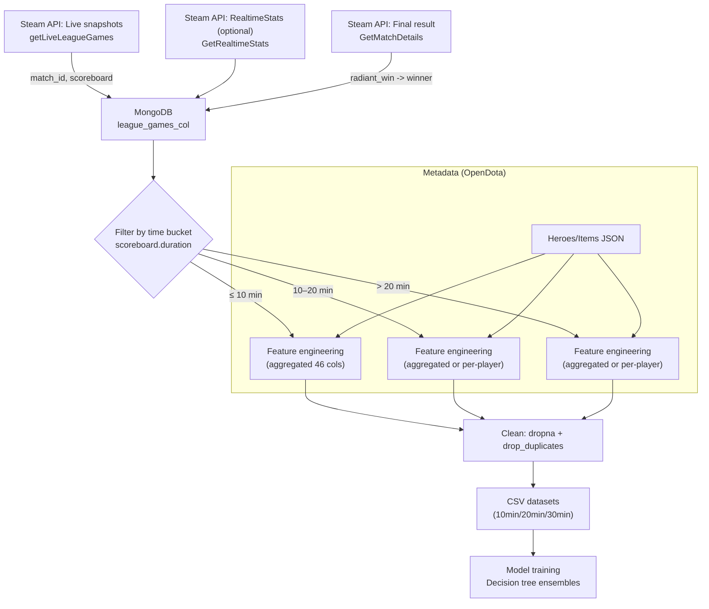
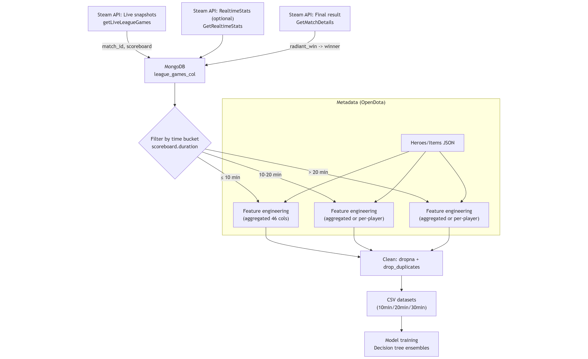

# End-to-end data pipeline: collection → preprocessing → labels → datasets

This document makes the preprocessing pipeline fully transparent and reproducible for the project “DotA 2 Match Outcome Prediction System Using Decision Tree Ensemble Algorithms”. It covers exactly how we:
- collect raw data (Steam API, OpenDota static data),
- synchronize game snapshots with ground-truth labels,
- engineer features and handle missing values,
- define the target label used to train win-probability models,
- generate the CSV datasets used by the training scripts across 10/20/30 minute horizons.

## What’s produced

- Supervised learning tables with one row per match snapshot and a binary target column `winner` ∈ {radiant, dire}.
- Time-bucketed datasets by in-game duration at snapshot time: ≤10min, 10–20min, and >20min.

Location of generated data examples:
- Aggregated features (46 columns): `datasets/10min_*.csv`, `datasets/20min_*.csv`, `datasets/30min_*.csv`
- Rich per-player features (186 columns): `part_7/*_samples.csv`

## Data sources and synchronization

- Steam API (primary, transactional data)
  - Live league snapshots: `IDOTA2Match_570/getLiveLeagueGames`
    - Miner: `part_4/Miners/Steam/LiveLeagueGames.py` → MongoDB collection `steam_dota_api.league_games_col`
  - Real-time stats (public matches): `IDOTA2MatchStats_570/GetRealtimeStats` (used in experiments)
    - Miner: `part_4/Miners/Steam/RealtimeStats.py` → MongoDB collection `steam_dota_api.multi_real_time_stats`
  - Final ground-truth winner: `IDOTA2Match_570/GetMatchDetails`
    - Label attachers: `part_4/Miners/Steam/GetLeagueWin.py` and `GetWinImportToDB.py` (update documents with `winner: 'radiant'|'dire'`)

- OpenDota (static metadata only)
  - Hero/item catalogs for embedding and feature experiments (e.g., `part_10_generate_train/heroes.json`, `items.json`). No labels are sourced from OpenDota in the final pipeline; it is used for metadata enrichment only.

### How synchronization works

- Steam “live” snapshots are upserted by `match_id` into MongoDB as games progress.
- After a match completes, `GetMatchDetails` is called for that `match_id`; we set `winner = 'radiant'` if `result.radiant_win == true` else `'dire'`.
  - See `part_4/Miners/Steam/GetLeagueWin.py` (league) and `GetWinImportToDB.py` (public): both update existing snapshot documents in-place by `match_id`.
- Training datasets are later built by filtering only documents where `winner` exists (i.e., match completed and labeled).

## Preprocessing and feature engineering

We generate two families of feature tables depending on the experiment.

1) Aggregated team-difference features (compact, 46 columns)
   - Script: `part_8/create_csv.py` and `part_10_generate_train/create_dataframes.py`
   - Inputs: `steam_dota_api.league_games_col`
   - Time filters: three disjoint buckets by `scoreboard.duration` (seconds)
     - ≤600 (≤10 min), 600–1200 (10–20 min), >1200 (>20 min)
   - Features
     - Match duration: `duration` (seconds from scoreboard)
     - Series score context: `radiant_series_wins`, `dire_series_wins`
     - Score differential at snapshot: `score = radiant.score - dire.score`
     - Tower state (bit-unpacked): `0_rts..10_rts` and `0_dts..10_dts` from 11-bit bitfields
     - Barracks state (bit-unpacked): `0_rbs..5_rbs` and `0_dbs..5_dbs` from 6-bit bitfields
     - Team-difference aggregates (radiant − dire): `net_worth, assissts, last_hits, gold, level, gpm, xpm`
     - Target: `winner ∈ {radiant, dire}`

2) Rich per-player features (wide, 186 columns)
   - Script: `part_7/create_csv.py`
   - Same time filters; includes per-player stats and items for both teams:
     - For each player i ∈ {0..4} on both teams: kills, deaths, assists, last_hits, gold, level, gold_per_min, xp_per_min, net_worth, item0..item5
     - Plus tower/barracks bit-unpacked states, `duration`, etc.
     - Target: `winner`

### Handling missing values and data quality

We apply conservative row-level filters and then Pandas cleaning:
- Drop snapshots without the expected scoreboard branch:
  - `if 'radiant' not in entry['scoreboard']`: skip (see `create_csv.py` and `create_dataframes.py`)
- Ensure a full 5v5 snapshot is present for both teams before using per-player features:
  - `if len(entry['scoreboard']['radiant']['players']) != 5: continue`
  - `if len(entry['scoreboard']['dire']['players']) != 5: continue`
- After constructing the DataFrame:
  - `df = df.dropna()` removes any rows with missing values produced during feature engineering
  - `df = df.drop_duplicates()` removes exact duplicate rows

Note: no imputation is used in the published results; rows with any missing values are discarded to avoid introducing bias.

### Data types and bit unpacking

Tower and barracks states arrive as integer bitfields. We expand them to binary indicator columns using zero-padded binary strings:
- Towers: 11 bits → `0..10` per side
- Barracks: 6 bits → `0..5` per side

Example (from `part_8/create_csv.py`):
```python
rts = entry['scoreboard']['radiant']['tower_state']
for i, t in enumerate(format(rts, 'b').zfill(11)):
    tmp[f'{i}_rts'] = t
```
The same is applied to dire towers (`_dts`) and to barracks (`_rbs`, `_dbs`).

## Label definition for “win probability”

- Ground truth comes from Steam `GetMatchDetails`: `radiant_win: bool`.
- We store a string label `winner ∈ {radiant, dire}` at the snapshot document for the corresponding `match_id`.
- For modeling, this is converted to a binary target via `LabelEncoder` (scikit-learn):
  - In code, `y = LabelEncoder().fit_transform(df['winner'])` (see `part_7/train.py`).
  - For clarity in reproduction, we define a deterministic mapping in analysis: `y = 1 if winner == 'radiant' else 0`.
- “Win probability” in evaluation plots refers to the classifier’s predicted probability for the positive class at time t, where the label is the eventual match winner.

## End-to-end flowchart





## Pseudocode (reproducible outline)

```pseudo
# 1) Mining (one-time or periodic):
while True:
  for game in Steam.getLiveLeagueGames(key):
    if game.has_scoreboard and game.scoreboard.duration > 0:
      upsert MongoDB.league_games_col[match_id] = game (strip logos)
  sleep ~60s

# After matches complete, attach ground-truth winner:
for match_id in MongoDB.league_games_col.distinct('match_id', winner not set):
  details = Steam.getMatchDetails(key, match_id)
  if 'radiant_win' in details.result:
    winner = 'radiant' if details.result.radiant_win else 'dire'
    MongoDB.league_games_col.update_many(match_id, set winner)
  else:
    delete documents for match_id  # incomplete/unavailable results

# 2) Dataset building per time bucket (example: aggregated features):
for bucket in [(0,600),(600,1200),(1200, inf)]:
  rows = []
  for doc in MongoDB.league_games_col.find(winner exists,
                                           duration in bucket,
                                           scoreboard.radiant present,
                                           radiants_players_count==5,
                                           dires_players_count==5):
    feat = {}
    feat.duration = doc.scoreboard.duration
    feat.radiant_series_wins = doc.radiant_series_wins
    feat.dire_series_wins = doc.dire_series_wins
    feat.score = doc.scoreboard.radiant.score - doc.scoreboard.dire.score
    feat.0_rts..10_rts = unpackBits(doc.scoreboard.radiant.tower_state, 11)
    feat.0_dts..10_dts = unpackBits(doc.scoreboard.dire.tower_state, 11)
    feat.0_rbs..5_rbs = unpackBits(doc.scoreboard.radiant.barracks_state, 6)
    feat.0_dbs..5_dbs = unpackBits(doc.scoreboard.dire.barracks_state, 6)
    feat.net_worth = sum(radiant.net_worth) - sum(dire.net_worth)
    feat.assissts  = sum(radiant.assists)   - sum(dire.assists)
    feat.last_hits = sum(radiant.last_hits) - sum(dire.last_hits)
    feat.gold      = sum(radiant.gold)      - sum(dire.gold)
    feat.level     = sum(radiant.level)     - sum(dire.level)
    feat.gpm       = sum(radiant.gpm)       - sum(dire.gpm)
    feat.xpm       = sum(radiant.xpm)       - sum(dire.xpm)
    feat.winner    = doc.winner  # 'radiant' | 'dire'
    rows.append(feat)

  df = DataFrame(rows)
  df.dropna(inplace=True)
  df.drop_duplicates(inplace=True)
  write_csv(f"{bucket_name}_{df.shape[0]}x{df.shape[1]}.csv")

# 3) Training (example):
df = read_csv(...)
X = df.iloc[:, 0:-1]
y = (df.winner == 'radiant').astype(int)
fit sklearn models and evaluate
```

## How to reproduce (minimal)

- Run miners to populate MongoDB (Steam key required, set via `.env` as `STEAM_KEY`):
  - `part_4/Miners/Steam/LiveLeagueGames.py` (league snapshots)
  - `part_4/Miners/Steam/GetLeagueWin.py` (attach `winner`)
- Build CSVs from MongoDB:
  - Compact features: `part_8/create_csv.py` or `part_10_generate_train/create_dataframes.py`
  - Rich per-player features: `part_7/create_csv.py`
- Train and evaluate:
  - See `part_7/train.py`, `part_8/train.py`, and notebooks under `part_5/`, `part_6/`, `part_7/`, `part_9_embedding/`

## Notes and assumptions

- All timing filters use scoreboard `duration` in seconds.
- If a match’s final result cannot be retrieved from Steam (`radiant_win` missing), we drop that match_id entirely (see the cleanup block in `GetLeagueWin.py` / `GetWinImportToDB.py`).
- No label is ever inferred from OpenDota; it is used for static metadata (heroes/items) only.
- We prefer conservative row removal to any imputation to keep labels/features faithful to in-game reality at snapshot time.
