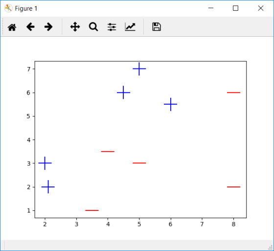
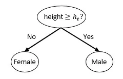
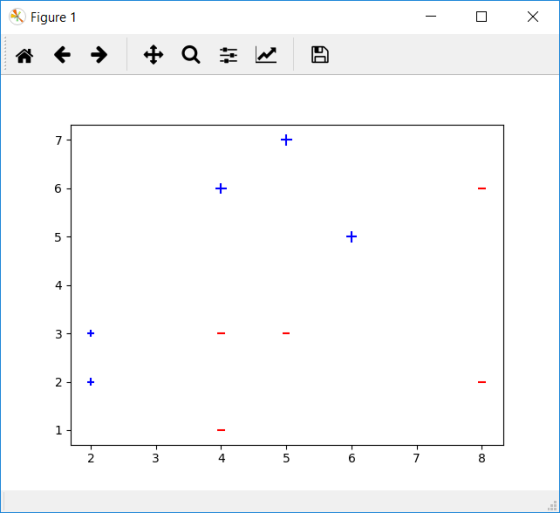
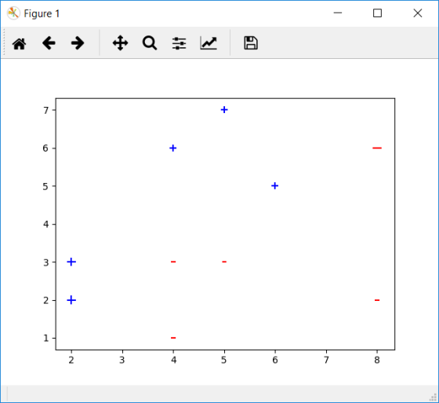
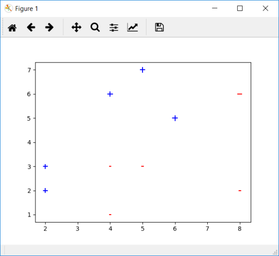
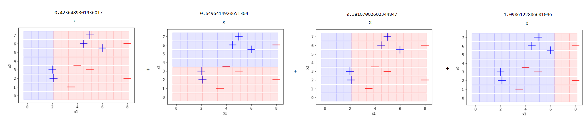
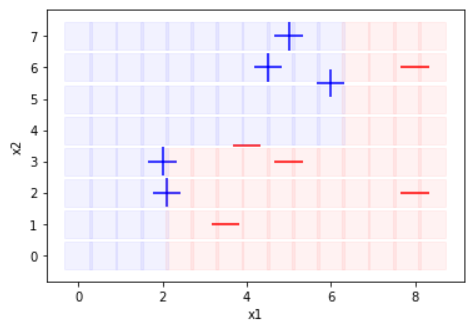
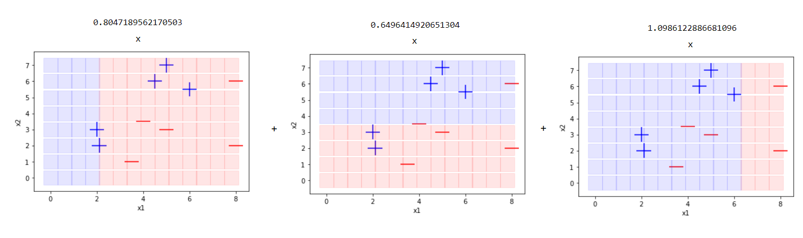

# Adaptive boosting or shortly adaboost

The algorithm expects to run weak learners.

A weak learner cannot solve non-linear problems but its sequential usage enables to solve non-linear problems. The trick is to increase the weight of incorrect decisions and to decrease the weight of correct decisions between sequences. Adaboost is not related to decision trees. You might consume an 1-level basic decision tree (decision stumps) but this is not a must.

## Data set

We are going to work on the following data set. Each instances are represented as 2-dimensional space and we also have its class value.

| x1  | x2  | Decision |
| --- | --- | -------- |
| 2   | 3   | true     |
| 2.1 | 2   | true     |
| 4.5 | 6   | true     |
| 4   | 3.5 | false    |
| 3.5 | 1   | false    |
| 5   | 7   | true     |
| 5   | 3   | false    |
| 6   | 5.5 | true     |
| 8   | 6   | false    |
| 8   | 2   | false    |



We would like to separate true and false classes. This is not a linearly separable problem. Linear classifiers such as perceptrons or decision stumps cannot classify this problem. Herein, adaboost enables linear classifiers to solve this problem.

## Decision stumps

Decision trees approaches problems with divide and conquer method. They might have lots of nested decision rules. This makes them non-linear classifiers.

In contrast, decision stumps are 1-level decision trees. They are linear classifiers just like (single layer) perceptrons.

---

You might think that if height of someone is greater than 1.70 meters (5.57 feet), then it would be male. Otherwise, it would be female.



This decision stump would classify gender correctly at least 50% accuracy. That’s why, these classifiers are weak learners.

# Regression for adaboost

## Round 1

The main principle in adaboost is to increase the weight of unclassified ones and to decrease the weight value of classified ones.

But we are working on a classification problem. Target values in the data set are nominal values. That’s why, we are going to transform the problem to a regression task.

I will set **true** classes to **1** whereas **false** classes to **-1** to handle this.

$True = 1$

$False = -1$

Initially, we distribute **weights** in uniform distribution. I set weights of all instances to **1/n** where n is the total number of instances.

$Weight_i = 1 / n = 1 / 10$

Weighted actual stores weight times actual value for each line.

$WeightActual_i = actual * weight$

$WeightActual_1 = 1 * 0.1 = 0.1$

| x1  | x2  | actual | weight | weighted_actual |
| --- | --- | ------ | ------ | --------------- |
| 2   | 3   | 1      | 0.1    | 0.1             |
| 2   | 2   | 1      | 0.1    | 0.1             |
| 4   | 6   | 1      | 0.1    | 0.1             |
| 4   | 3   | -1     | 0.1    | -0.1            |
| 4   | 1   | -1     | 0.1    | -0.1            |
| 5   | 7   | 1      | 0.1    | 0.1             |
| 5   | 3   | -1     | 0.1    | -0.1            |
| 6   | 5   | 1      | 0.1    | 0.1             |
| 8   | 6   | -1     | 0.1    | -0.1            |
| 8   | 2   | -1     | 0.1    | -0.1            |

Now, we are going to use weighted actual as target value whereas x1 and x2 are features to build a decision stump. The following rule set is created when I run the decision stump algorithm.

```python
def findDecision(x1, x2):
    if x1 > 2.1: return -0.025
    if x1 <= 2.1: return 0.1
```

We’ve set actual values as values ±1 but decision stump returns decimal values. Here, the trick is applying sign function handles this issue.

```python
def sign(x):
    if x > 0: return 1
    elif x < 0: return -1
    else: return 0
```

To sum up, prediction will be

$sign(-0.025) = -1$ (when x1 is greater than 2.1),

and it will be

$sign(0.1) = 1$ (when x1 is less than or equal to 2.1.)

I’ll put predictions as a column. Also, I check the equality of actual and prediction in loss column. It will be 0 if the prediction is correct, will be 1 if the prediction is incorrect.

| x1  | x2  | actual | weight | weighted_actual | prediction | loss | weight \* loss |
| --- | --- | ------ | ------ | --------------- | ---------- | ---- | -------------- |
| 2   | 3   | 1      | 0.1    | 0.1             | 1          | 0    | 0              |
| 2   | 2   | 1      | 0.1    | 0.1             | 1          | 0    | 0              |
| 4   | 6   | 1      | 0.1    | 0.1             | -1         | 1    | 0.1            |
| 4   | 3   | -1     | 0.1    | -0.1            | -1         | 0    | 0              |
| 4   | 1   | -1     | 0.1    | -0.1            | -1         | 0    | 0              |
| 5   | 7   | 1      | 0.1    | 0.1             | -1         | 1    | 0.1            |
| 5   | 3   | -1     | 0.1    | -0.1            | -1         | 0    | 0              |
| 6   | 5   | 1      | 0.1    | 0.1             | -1         | 1    | 0.1            |
| 8   | 6   | -1     | 0.1    | -0.1            | -1         | 0    | 0              |
| 8   | 2   | -1     | 0.1    | -0.1            | -1         | 0    | 0              |

Sum of weight \* loss column stores the total error. It is 0.3 in this case.

$$
\epsilon = \sum{weight * loss}
$$

$\epsilon = 0.1 + 0.1 + 0.1 = 0.3$

Here, we’ll define a new variable alpha. It stores logarithm (1 – epsilon)/epsilon to the base e over 2.

$$
\alpha = \frac{\ln^{\frac{1-\epsilon}{\epsilon}}}{2}
$$

$\alpha = ln[(1-\epsilon)/\epsilon] / 2 = ln[(1 – 0.3)/0.3] / 2 = 0.42$

We’ll use alpha to update weights in the next round.

$$
W_{i+1} = W_i * e^{-\alpha * actual * prediction}
$$

$$\text{ where i refers to instance number}$$

instance 1) $W_{i+1} = 0.1 * e^{-0.42 \cdot 1 \cdot 1} = 0.065$

instance 2) $W_{i+1} = 0.1 * e^{-0.42 \cdot 1 \cdot 1} = 0.065$

instance 3) $W_{i+1} = 0.1 * e^{-0.42 \cdot 1 \cdot (-1)} = 0.153$

...

instance 10) $W_{i+1} = -0.1 * e^{-0.42 \cdot (-1) \cdot (-1)} = 0.065$

<br>

Also, sum of weights must be equal to 1. That’s why, we have to normalize weight values. Dividing each weight value to sum of weights column enables normalization.

$$
norm(W_{i+1}) = \frac{W_{i+1}}{\sum W_{i+1}}
$$

instance 1) $norm(W_{i+1}) = \frac{0.065}{0.914} = 0.071$

instance 2) $norm(W_{i+1}) = \frac{0.065}{0.914} = 0.071$

instance 3) $norm(W_{i+1}) = \frac{0.153}{0.914} = 0.167$

...

instance 4) $norm(W_{i+1}) = \frac{0.065}{0.914} = 0.071$

| x1  | x2  | actual | weight | prediction | w\_(i+1) | norm(w\_(i+1)) |
| --- | --- | ------ | ------ | ---------- | -------- | -------------- |
| 2   | 3   | 1      | 0.1    | 1          | 0.065    | 0.071          |
| 2   | 2   | 1      | 0.1    | 1          | 0.065    | 0.071          |
| 4   | 6   | 1      | 0.1    | -1         | 0.153    | 0.167          |
| 4   | 3   | -1     | 0.1    | -1         | 0.065    | 0.071          |
| 4   | 1   | -1     | 0.1    | -1         | 0.065    | 0.071          |
| 5   | 7   | 1      | 0.1    | -1         | 0.153    | 0.167          |
| 5   | 3   | -1     | 0.1    | -1         | 0.065    | 0.071          |
| 6   | 5   | 1      | 0.1    | -1         | 0.153    | 0.167          |
| 8   | 6   | -1     | 0.1    | -1         | 0.065    | 0.071          |
| 8   | 2   | -1     | 0.1    | -1         | 0.065    | 0.071          |

<br>

## Round 2

I shift norm(w\_(i+1)) column to weight column in this round. Then, build a decision stump. Still, x1 and x2 are features whereas weighted actual is the target value.

| x1  | x2  | actual | weight | weighted_actual |
| --- | --- | ------ | ------ | --------------- |
| 2   | 3   | 1      | 0.071  | 0.071           |
| 2   | 2   | 1      | 0.071  | 0.071           |
| 4   | 6   | 1      | 0.167  | 0.167           |
| 4   | 3   | -1     | 0.071  | -0.071          |
| 4   | 1   | -1     | 0.071  | -0.071          |
| 5   | 7   | 1      | 0.167  | 0.167           |
| 5   | 3   | -1     | 0.071  | -0.071          |
| 6   | 5   | 1      | 0.167  | 0.167           |
| 8   | 6   | -1     | 0.071  | -0.071          |
| 8   | 2   | -1     | 0.071  | -0.071          |

Graph of the new data set is demonstrated below. Weights of correct classified ones decreased whereas incorrect ones increased.



The following decision stump will be built for this data set.

```python
def findDecision(x1, x2):
    if x2 <= 3.5:   return -0.02380952380952381
    if x2 > 3.5:    return 0.10714285714285714
```

I’ve applied sign function to predictions. Then, I put loss and weight times loss values as columns.

| x1  | x2  | actual | weight | prediction | loss | weight \* loss |
| --- | --- | ------ | ------ | ---------- | ---- | -------------- |
| 2   | 3   | 1      | 0.071  | -1         | 1    | 0.071          |
| 2   | 2   | 1      | 0.071  | -1         | 1    | 0.071          |
| 4   | 6   | 1      | 0.167  | 1          | 0    | 0.000          |
| 4   | 3   | -1     | 0.071  | -1         | 0    | 0.000          |
| 4   | 1   | -1     | 0.071  | -1         | 0    | 0.000          |
| 5   | 7   | 1      | 0.167  | 1          | 0    | 0.000          |
| 5   | 3   | -1     | 0.071  | -1         | 0    | 0.000          |
| 6   | 5   | 1      | 0.167  | 1          | 0    | 0.000          |
| 8   | 6   | -1     | 0.071  | 1          | 1    | 0.071          |
| 8   | 2   | -1     | 0.071  | -1         | 0    | 0.000          |

I can calculate error and alpha values for round 2.

$\epsilon = 0.21, \alpha = 0.65$

So, weights for the following round can be found.

| x1  | x2  | actual | weight | prediction | w\_(i+1) | norm(w\_(i+1)) |
| --- | --- | ------ | ------ | ---------- | -------- | -------------- |
| 2   | 3   | 1      | 0.071  | -1         | 0.137    | 0.167          |
| 2   | 2   | 1      | 0.071  | -1         | 0.137    | 0.167          |
| 4   | 6   | 1      | 0.167  | 1          | 0.087    | 0.106          |
| 4   | 3   | -1     | 0.071  | -1         | 0.037    | 0.045          |
| 4   | 1   | -1     | 0.071  | -1         | 0.037    | 0.045          |
| 5   | 7   | 1      | 0.167  | 1          | 0.087    | 0.106          |
| 5   | 3   | -1     | 0.071  | -1         | 0.037    | 0.045          |
| 6   | 5   | 1      | 0.167  | 1          | 0.087    | 0.106          |
| 8   | 6   | -1     | 0.071  | 1          | 0.137    | 0.167          |
| 8   | 2   | -1     | 0.071  | -1         | 0.037    | 0.045          |

<br>

## Round 3

I skipped calculations for the following rounds

| x1  | x2  | actual | weight | prediction | loss | w \* loss | w\_(i+1) | norm(w\_(i+1)) |
| --- | --- | ------ | ------ | ---------- | ---- | --------- | -------- | -------------- |
| 2   | 3   | 1      | 0.167  | 1          | 0    | 0.000     | 0.114    | 0.122          |
| 2   | 2   | 1      | 0.167  | 1          | 0    |           | 0.000    | 0.114          |
| 4   | 6   | 1      | 0.106  | -1         | 1    | 0.106     | 0.155    | 0.167          |
| 4   | 3   | -1     | 0.045  | -1         | 0    | 0.000     | 0.031    | 0.033          |
| 4   | 1   | -1     | 0.045  | -1         | 0    | 0.000     | 0.031    | 0.033          |
| 5   | 7   | 1      | 0.106  | -1         | 1    | 0.106     | 0.155    | 0.167          |
| 5   | 3   | -1     | 0.045  | -1         | 0    | 0.000     | 0.031    | 0.033          |
| 6   | 5   | 1      | 0.106  | -1         | 1    | 0.106     | 0.155    | 0.167          |
| 8   | 6   | -1     | 0.167  | -1         | 0    | 0.000     | 0.114    | 0.122          |
| 8   | 2   | -1     | 0.045  | -1         | 0    | 0.000     | 0.031    | 0.033          |

$\epsilon = 0.31, \alpha = 0.38$



```python
def findDecision(x1, x2):
    if x1 > 2.1:
        return -0.003787878787878794
    if x1 <= 2.1:
        return 0.16666666666666666
```

<br>

## Round 4

| x1  | x2  | actual | weight | prediction | loss | w \* loss | w\_(i+1) | norm(w\_(i+1)) |
| --- | --- | ------ | ------ | ---------- | ---- | --------- | -------- | -------------- |
| 2   | 3   | 1      | 0.122  | 1          | 0    | 0.000     | 0.041    | 0.068          |
| 2   | 2   | 1      | 0.122  | 1          | 0    | 0.000     | 0.041    | 0.068          |
| 4   | 6   | 1      | 0.167  | 1          | 0    | 0.000     | 0.056    | 0.093          |
| 4   | 3   | -1     | 0.033  | 1          | 1    | 0.033     | 0.100    | 0.167          |
| 4   | 1   | -1     | 0.033  | 1          | 1    | 0.033     | 0.100    | 0.167          |
| 5   | 7   | 1      | 0.167  | 1          | 0    | 0.000     | 0.056    | 0.093          |
| 5   | 3   | -1     | 0.033  | 1          | 1    | 0.033     | 0.100    | 0.167          |
| 6   | 5   | 1      | 0.167  | 1          | 0    | 0.000     | 0.056    | 0.093          |
| 8   | 6   | -1     | 0.122  | -1         | 0    | 0.000     | 0.041    | 0.068          |
| 8   | 2   | -1     | 0.033  | -1         | 0    | 0.000     | 0.011    | 0.019          |

$\epsilon = 0.10, \alpha = 1.10$



```python
def findDecision(x1,x2):
    if x1 <= 6.0:
        return 0.08055555555555555
    if x1 > 6.0:
        return -0.07777777777777778
```

# Prediction

Cumulative sum of each round’s alpha times prediction gives the final prediction

$$
FinalPrediction = \sum \alpha_i \cdot prediction_i
$$

| round 1 alpha          | round 2 alpha          | round 3 alpha          | round 4 alpha          |
| ---------------------- | ---------------------- | ---------------------- | ---------------------- |
| 0.42                   | 0.65                   | 0.38                   | 1.1                    |
| **round 1 prediction** | **round 2 prediction** | **round 3 prediction** | **round 4 prediction** |
| 1                      | -1                     | 1                      | 1                      |
| 1                      | -1                     | 1                      | 1                      |
| -1                     | 1                      | -1                     | 1                      |
| -1                     | -1                     | -1                     | 1                      |
| -1                     | -1                     | -1                     | 1                      |
| -1                     | 1                      | -1                     | 1                      |
| -1                     | -1                     | -1                     | 1                      |
| -1                     | 1                      | -1                     | 1                      |
| -1                     | 1                      | -1                     | -1                     |
| -1                     | -1                     | -1                     | -1                     |

For example, prediction of the 1st instance will be

$0.42 \cdot 1 + 0.65 \cdot (-1) + 0.38 \cdot 1 + 1.1 \cdot 1 = 1.25$

And we will apply sign function

$Sign(1.25) = +1$ aka **true** which is correctly classified.

We can summarize adaboost calculations as illustrated below. There are 4 different (weak) classifier and its multiplier alphas.

Instances located in blue area will be classified as true whereas located in read area will be classified as false.


If we apply this calculation for all instances, all instances are classified correctly. In this way, you can find decision for a new instance not appearing in the train set.



## Pruning

You might realize that both round 1 and round 3 produce same results.

Pruning in adaboost proposes to remove similar weak classifier to overperform.

Besides, you should increase the multiplier alpha value of remaining one. In this case, I remove round 3 and append its coefficient to round 1.

$\alpha(round 1) = 0.42 + 0.38 = 0.8$



Even though we’ve used linear weak classifiers, all instances can be classified correctly.
