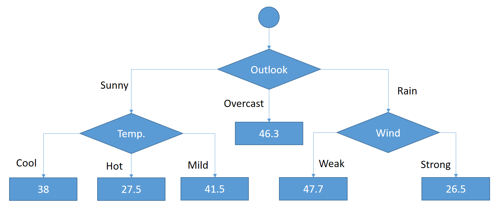

# Gradient Boosting Decision Tree algorithm

> We initially create a decision tree for the raw data set (Giant step)

> We will create new decision tree based on previous tree’s error (Baby steps). We will apply this approach several times.

<br>

Terence Parr described this process wonderfully in golf playing scenario as illustrated below.


Boosting in golf

<br>

> Data set remains same in GBM (Gradient Boosting Model). We will create a decision tree, we will feed decision tree algorithm same data set but we will update each instance’s label value as its actual value minus its prediction.

# Summing the predictions

Following illustration shows that first decision tree returns **2** as a result for the boy. Then, we will build another decision tree based on errors for the first decision tree’s results. It returns **0.9** in this time for the boy. Final decision for the boy would be **2.9** which sums the prediction of sequential trees.


# Example

| Day | Outlook  | Temp. | Humidity | Wind   | Golf Players |
| --- | -------- | ----- | -------- | ------ | ------------ |
| 1   | Sunny    | Hot   | High     | Weak   | 25           |
| 2   | Sunny    | Hot   | High     | Strong | 30           |
| 3   | Overcast | Hot   | High     | Weak   | 46           |
| 4   | Rain     | Mild  | High     | Weak   | 45           |
| 5   | Rain     | Cool  | Normal   | Weak   | 52           |
| 6   | Rain     | Cool  | Normal   | Strong | 23           |
| 7   | Overcast | Cool  | Normal   | Strong | 43           |
| 8   | Sunny    | Mild  | High     | Weak   | 35           |
| 9   | Sunny    | Cool  | Normal   | Weak   | 38           |
| 10  | Rain     | Mild  | Normal   | Weak   | 46           |
| 11  | Sunny    | Mild  | Normal   | Strong | 48           |
| 12  | Overcast | Mild  | High     | Strong | 52           |
| 13  | Overcast | Hot   | Normal   | Weak   | 44           |
| 14  | Rain     | Mild  | High     | Strong | 30           |

And we’ve built the following decision tree.



<br>

> Let’s check the Day 1 and Day 2 instances.

> They both have sunny outlook and hot temperature.

> Built decision tree says that decision will be 27.5 for sunny outlook and hot temperature.

> However, day 1 should be 25 and day 2 should be 30.

> This means that the error (or residual) is

$25 – 27.5 = -2.5$ for day 1

and $30 – 27.5 = +2.5$ for day 2.

> The following days have similar errors. We will boost these errors.

## **Loss function**

> This is not a must but we will use mean squared error as loss function.

loss = (1/2) x (y – y’)2

<br/>

Standard deviation formula

$$L ={{\frac {1}{2}}(y_{i} - \gamma_{i})^{2}}$$

$$\text{ where }y_{i} \text{ - actual  value,  } \gamma_{i} \text{ - predicted value}$$

<br/>

> Gradient refers to gradient descent in gradient boosting.

> We will update each prediction as partial derivative of loss function with respect to the prediction. Let’s find this derivative first.

<br>

$${\frac {dL}{d\gamma}} = \frac{d(\frac{1}{2} (y_{i} - \gamma_{i})^{2})}{d\gamma} = \frac{\frac{1}{2} 2 (y_{i} - \gamma_{i}) d(-\gamma)}{d\gamma} = (y_{i} - \gamma_{i})(-1) = \gamma_i - y_i$$

<br>

> Now, we can update predictions by applying the following formula.

$$\gamma_i = \gamma_i - \alpha \frac{dL}{d\gamma} \text{, where } \alpha \text{ - learning rate}$$

<br>

> I set **α** to **1** to make formula simpler.

$$ -\alpha \frac{dL}{d\gamma} = -\alpha (-1) (y*{i} - \gamma*{i}) = y*{i} - \gamma*{i}$$

> This is the label that we are going to build a new decision tree.

## Epoch 1

> Remember that error was -2.5 for day 1 and +2.5 for day 2.

> Similarly, we’ll find the errors based on the built decision tree’s results and actual labels for the following days.

> Then, a new data set will be created and residual for each line set to its decision column.

| Day | Outlook  | Temp. | Humidity | Wind   | Decision |
| --- | -------- | ----- | -------- | ------ | -------- |
| 1   | Sunny    | Hot   | High     | Weak   | -2.5     |
| 2   | Sunny    | Hot   | High     | Strong | 2.5      |
| 3   | Overcast | Hot   | High     | Weak   | -0.25    |
| 4   | Rain     | Mild  | High     | Weak   | -2.66    |
| 5   | Rain     | Cool  | Normal   | Weak   | 4.333    |
| 6   | Rain     | Cool  | Normal   | Strong | -3.5     |
| 7   | Overcast | Cool  | Normal   | Strong | -3.25    |
| 8   | Sunny    | Mild  | High     | Weak   | -6.5     |
| 9   | Sunny    | Cool  | Normal   | Weak   | 0        |
| 10  | Rain     | Mild  | Normal   | Weak   | -1.66    |
| 11  | Sunny    | Mild  | Normal   | Strong | 6.5      |
| 12  | Overcast | Mild  | High     | Strong | 5.75     |
| 13  | Overcast | Hot   | Normal   | Weak   | -2.25    |
| 14  | Rain     | Mild  | High     | Strong | 3.55     |

> Now, it is time to build a new decision tree based on the data set above.

> The following code block will generate decision rules for the current data frame.

```python
def findDecision(Outlook, Temperature, Humidity, Wind):
   if Wind == 'Weak':
      if Temperature == 'Hot':
         return -1.6666666666666667
      if Temperature == 'Mild':
         return -3.6111111111111094
      if Temperature == 'Cool':
         return 2.166666666666668
   if Wind == 'Strong':
      if Temperature == 'Mild':
         return 5.25
      if Temperature == 'Cool':
         return -3.375
      if Temperature == 'Hot':
         return 2.5
```

## Epoch 2

> Let’s look for predictions of day 1 and day 2 again.

> Now, built decision tree says that day 1 has weak wind and hot temperature and it is **-1.666** but its actual value was **-2.5** in the 2nd data set.

This means that error is

$-2.5 – (-1.666) = -0.833$

> Similarly, the tree says that day 2 has strong wind and hot temperature

> it is predicted as 2.5 whereas its actual value is 2.5, too.

In this case, error is equal to

$2.5 – 2.5 = 0$

<br>

> In this way, I calculate each instance’s prediction and subtract from its actual value again.

| Day | Outlook  | Temp. | Humidity | Wind   | Decision |
| --- | -------- | ----- | -------- | ------ | -------- |
| 1   | Sunny    | Hot   | High     | Weak   | -0.833   |
| 2   | Sunny    | Hot   | High     | Strong | 0.0      |
| 3   | Overcast | Hot   | High     | Weak   | 1.416    |
| 4   | Rain     | Mild  | High     | Weak   | 0.944    |
| 5   | Rain     | Cool  | Normal   | Weak   | 2.166    |
| 6   | Rain     | Cool  | Normal   | Strong | -0.125   |
| 7   | Overcast | Cool  | Normal   | Strong | 0.125    |
| 8   | Sunny    | Mild  | High     | Weak   | -2.888   |
| 9   | Sunny    | Cool  | Normal   | Weak   | -2.166   |
| 10  | Rain     | Mild  | Normal   | Weak   | 1.944    |
| 11  | Sunny    | Mild  | Normal   | Strong | 1.25     |
| 12  | Overcast | Mild  | High     | Strong | 0.5      |
| 13  | Overcast | Hot   | Normal   | Weak   | -0.583   |
| 14  | Rain     | Mild  | High     | Strong | -1.75    |

> This time, the following rules will be created for the data set above.

```python
def findDecision(Outlook, Temperature, Humidity, Wind):
   if Outlook == 'Rain':
      if Wind == 'Weak':
         return 1.685185185185186
      if Wind == 'Strong':
         return -0.9375
   if Outlook == 'Sunny':
      if Wind == 'Weak':
         return -1.962962962962964
      if Wind == 'Strong':
         return 0.625
   if Outlook == 'Overcast':
      return 0.3645833333333334
```

## Epoch 3

...

## Epoch 4

...

## Epoch 5

> skipped epochs from 3 to 5 because same procedures are applied in each step.

> summarize each epoch’s predictions in the table shown below.

> We are going to calculate predictions cumulatively and sum values from epoch 1 to epoch 5 in each line to find the final prediction.

| Day | Actual | epoch 1 | epoch 2 | epoch 3 | epoch 4 | epoch 5   | prediction |
| --- | ------ | ------- | ------- | ------- | ------- | --------- | ---------- |
| 1   | 25     | 27.5    | -1.667  | -1.963  | 0.152   | 5.55E-17  | 24.023     |
| 2   | 30     | 27.5    | 2.5     | 0.625   | 0.152   | 5.55E-17  | 30.777     |
| 3   | 46     | 46.25   | -1.667  | 0.365   | 0.152   | 5.55E-17  | 45.1       |
| 4   | 45     | 47.667  | -3.611  | 1.685   | -0.586  | -1.88E-01 | 44.967     |
| 5   | 52     | 47.667  | 2.167   | 1.685   | 0.213   | 1.39E-17  | 51.731     |
| 6   | 23     | 26.5    | -3.375  | -0.938  | 0.213   | 1.39E-17  | 22.4       |
| 7   | 43     | 46.25   | -3.375  | 0.365   | 0.213   | 1.39E-17  | 43.452     |
| 8   | 35     | 41.5    | -3.611  | -1.963  | -0.586  | -7.86E-02 | 35.261     |
| 9   | 38     | 38      | 2.167   | -1.963  | 0.213   | 1.39E-17  | 38.416     |
| 10  | 46     | 47.667  | -3.611  | 1.685   | 0.442   | -1.88E-01 | 45.995     |
| 11  | 48     | 41.5    | 5.25    | 0.625   | 0.442   | -7.86E-02 | 47.739     |
| 12  | 52     | 46.25   | 5.25    | 0.365   | -0.586  | 7.21E-01  | 52         |
| 13  | 44     | 46.25   | -1.667  | 0.365   | 0.152   | 5.55E-17  | 45.1       |
| 14  | 30     | 26.5    | 5.25    | -0.938  | -0.586  | -1.88E-01 | 30.038     |

> predictions will be changed over epoch as illustrated below.

$1st Epoch = 27.5$

$2nd Epoch = 27.5 – 1.667 = 25.833$

$3rd Epoch = 27.5 – 1.667 – 1.963 = 23.87$

$4th Epoch = 27.5 – 1.667 – 1.963 + 0.152 = 24.022$

Absolute error was
$|25-27.5| = 2.5$ in 1st round for 1st day

but we can reduce it to $|25-24.023| = 0.97$ in 5th round.

> As seen, each instance’s prediction closes to its actual value when it is boosted.

<br>

### **Learning rate (α) and number of iterations (epoch) should be tuned for different problems.**

<br>

## Errors over iterations

> mean absolute error value for each epoch.

| Day     | epoch 1      | epoch 2      | epoch 3      | epoch 4     | epoch 5      |
| ------- | ------------ | ------------ | ------------ | ----------- | ------------ |
| 1       | 2.5          | 0.833        | 1.13         | 0.977       | 0.977        |
| 2       | 2.5          | 0            | 0.625        | 0.777       | 0.777        |
| 3       | 0.25         | 1.417        | 1.052        | 0.9         | 0.9          |
| 4       | 2.667        | 0.944        | 0.741        | 0.155       | 0.033        |
| 5       | 4.333        | 2.167        | 0.481        | 0.269       | 0.269        |
| 6       | 3.5          | 0.125        | 0.813        | 0.6         | 0.6          |
| 7       | 3.25         | 0.125        | 0.24         | 0.452       | 0.452        |
| 8       | 6.5          | 2.889        | 0.926        | 0.34        | 0.261        |
| 9       | 0            | 2.167        | 0.204        | 0.416       | 0.416        |
| 10      | 1.667        | 1.944        | 0.259        | 0.183       | 0.005        |
| 11      | 6.5          | 1.25         | 0.625        | 0.183       | 0.261        |
| 12      | 5.75         | 0.5          | 0.135        | 0.721       | 0            |
| 13      | 2.25         | 0.583        | 0.948        | 1.1         | 1.1          |
| 14      | 3.5          | 1.75         | 0.813        | 0.227       | 0.038        |
| **MAE** | **3.011111** | **1.112963** | **0.599383** | **0.48669** | **0.406115** |


We can definitely say that boosting works well.

The both random forest and gradient boosting are an approach instead of a core decision tree algorithm itself. They require to run core decision tree algorithms. They also build many decision trees in the background.

Feature Importance

Decision trees are naturally explainable and interpretable algorithms. However, it is hard to explain GBM. Herein, feature importance offers to understand models better.
