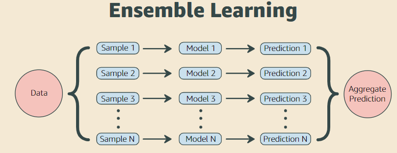
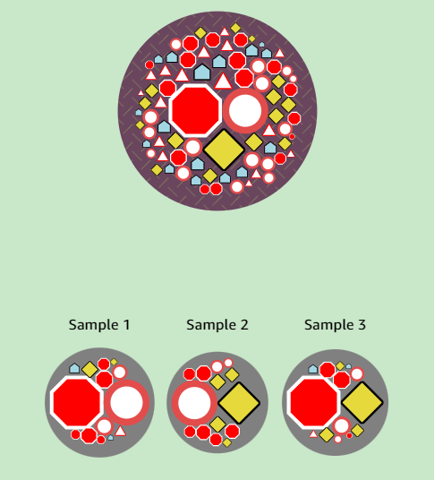
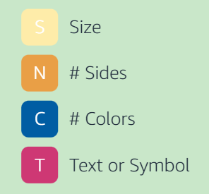
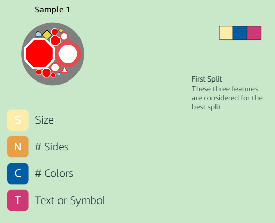
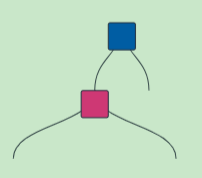
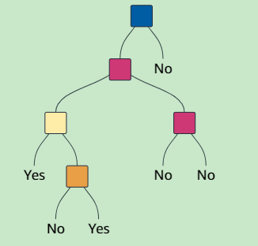
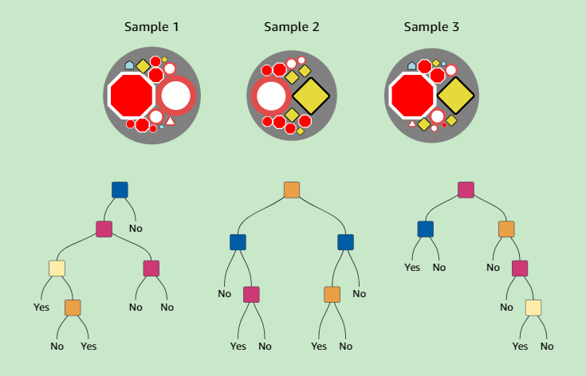
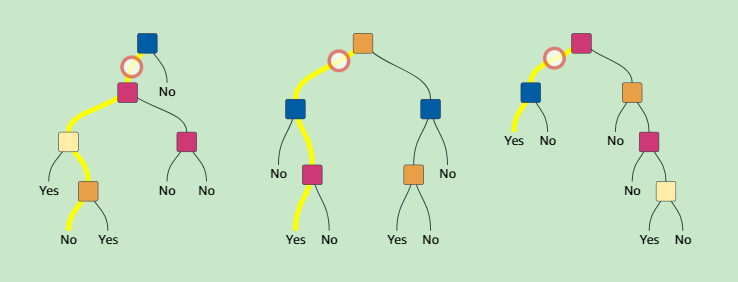

# Random Forest

Instead of applying decision tree algorithm on all dataset, dataset would be seperated into subsets and same decision tree algorithm would be applied to these subsets. Decision would be made by the highest number of subset results (Majority vote).

Why traditional decision tree algorithm evolved into random forests? Working on all dataset may cause to overfitting. In other words, it might cause memorizing instead of learning. In this case, you would have high accuracy on training set, but you would fail on newly instances.

Random forests work on multiple and small datasets. Increasing the dataset size would increase the learning time exponentially in decision tree. So, you can parallelize the learning procedure in random forest. In this way, learning time would last less than decision tree.

Ensemble learning creates a stronger model by aggregating the predictions of multiple weak models, such as decision trees.

## Bagging Method

One way to produce multiple models that are different is to train each model using a different training set. The Bagging (Bootstrap Aggregating) method randomly draws a fixed number of samples from the training set with replacement. This means that a data point can be drawn more than once.

## Feature Selection

Here are the features: Size, Number of Sides, Number of Colors Used, and Text or Symbol.

For each split of the tree building, we compute the best splitting using only a randomly selected subset of the features. This is another way to ensure that the decision trees are as different as possible.

## Sample 1

---

### Split 1

For the first split, three features are selected to find the best split.

The best feature to split is **"Number of Colors used"**

---

### Split 2

Likewise, for the second split, another set of three features are selected to find the best split. The best feature to split this time is "Text or Symbol."

---

### Split n

This process continues until the tree is constructed. 

## Sample n

The other samples will build other trees using the same process.

## Testing Random Forest

Can a small circular sign be a crossings sign? Let's ask the three trees!

## Majority vote

The first tree thinks that the sign is not a crossings sign. However, the other trees voted yes. By the majority vote, the prediction is "Yes"!