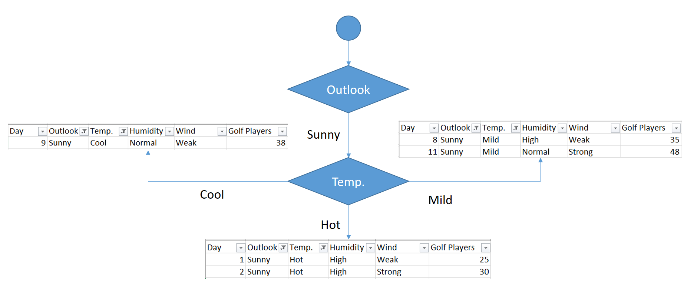

# CHAID algorithm

Decision trees which built for a data set where the the target column could be real number are called regression trees

- Decision rules will be found based on standard deviations.

# Example

| Day | Outlook  | Temp. | Humidity | Wind   | Golf Players |
| --- | -------- | ----- | -------- | ------ | ------------ |
| 1   | Sunny    | Hot   | High     | Weak   | 25           |
| 2   | Sunny    | Hot   | High     | Strong | 30           |
| 3   | Overcast | Hot   | High     | Weak   | 46           |
| 4   | Rain     | Mild  | High     | Weak   | 45           |
| 5   | Rain     | Cool  | Normal   | Weak   | 52           |
| 6   | Rain     | Cool  | Normal   | Strong | 23           |
| 7   | Overcast | Cool  | Normal   | Strong | 43           |
| 8   | Sunny    | Mild  | High     | Weak   | 35           |
| 9   | Sunny    | Cool  | Normal   | Weak   | 38           |
| 10  | Rain     | Mild  | Normal   | Weak   | 46           |
| 11  | Sunny    | Mild  | Normal   | Strong | 48           |
| 12  | Overcast | Mild  | High     | Strong | 52           |
| 13  | Overcast | Hot   | Normal   | Weak   | 44           |
| 14  | Rain     | Mild  | High     | Strong | 30           |

---

## **Standard deviation**

$Golf Players = GP$

$GP = {25, 30, 46, 45, 52, 23, 43, 35, 38, 46, 48, 52, 44, 30}$

$Average(GP) = \frac{25 + 30 + 46 + 45 + 52 + 23 + 43 + 35 + 38 + 46 + 48 + 52 + 44 + 30}{14} = 39.78$

 
Standard deviation formula

$${\displaystyle \sigma ={\sqrt {{\frac {1}{N}}\sum _{i=1}^{N}(x_{i}-\mu )^{2}}},{\text{ where }}\mu ={\frac {1}{N}}\sum _{i=1}^{N}x_{i}.}$$

 

$\sigma(GP) =  \sqrt{\frac{(25 – 39.78)^2 + (30 – 39.78)^2 + (46 – 39.78)^2 + … + (30 – 39.78)^2}{14}} = 9.32$

 

## **Outlook**

> Outlook can be sunny, overcast and rain. We need to calculate standard deviation of golf players for all of these outlook candidates.

 

### **Sunny** outlook

| Day | Outlook | Temp. | Humidity | Wind Golf | Players |
| --- | ------- | ----- | -------- | --------- | ------- |
| 1   | Sunny   | Hot   | High     | Weak      | 25      |
| 2   | Sunny   | Hot   | High     | Strong    | 30      |
| 8   | Sunny   | Mild  | High     | Weak      | 35      |
| 9   | Sunny   | Cool  | Normal   | Weak      | 38      |
| 11  | Sunny   | Mild  | Normal   | Strong    | 48      |

$Average(GP|Sunny) = \frac{25+30+35+38+48}{5} = 35.2$

$\sigma(GP|Sunny) = \sqrt{\frac{(25 – 35.2)^2 + (30 – 35.2)^2 + … }{5}} = 7.78$

 

### **Overcast** outlook

| Day | Outlook  | Temp. | Humidity | Wind   | Golf Players |
| --- | -------- | ----- | -------- | ------ | ------------ |
| 3   | Overcast | Hot   | High     | Weak   | 46           |
| 7   | Overcast | Cool  | Normal   | Strong | 43           |
| 12  | Overcast | Mild  | High     | Strong | 52           |
| 13  | Overcast | Hot   | Normal   | Weak   | 44           |

$Average(GP|Overcast) = \frac{46 + 43 + 52 + 44}{4} = 46.25$

$\sigma(GP|Overcast) = \sqrt{\frac{(46-46.25)^2+(43-46.25)^2+…}{4}}= 3.49$

 

### **Rainy** outlook

| Day | Outlook | Temp. | Humidity | Wind   | Golf Players |
| --- | ------- | ----- | -------- | ------ | ------------ |
| 4   | Rain    | Mild  | High     | Weak   | 45           |
| 5   | Rain    | Cool  | Normal   | Weak   | 52           |
| 6   | Rain    | Cool  | Normal   | Strong | 23           |
| 10  | Rain    | Mild  | Normal   | Weak   | 46           |
| 14  | Rain    | Mild  | High     | Strong | 30           |

$Average(GP|Rain) = \frac{45+52+23+46+30}{5} = 39.2$

$\sigma(GP|Rain) = \sqrt{\frac{(45 – 39.2^)2+(52 – 39.2)^2+…}{5}}=10.87$

 

### **Summarizing** standard deviations for the outlook feature

| Outlook  | Stdev of Golf Players | Instances |
| -------- | --------------------- | --------- |
| Overcast | 3.49                  | 4         |
| Rain     | 10.87                 | 5         |
| Sunny    | 7.78                  | 5         |

### **Weighted standard deviation** for outlook

 

$${\displaystyle \sigma = {\sum {\frac{Instances}{N} * \sigma_i}}}$$

 

$WSD(outlook) = \frac{4}{14}*3.49 + \frac{5}{14}*10.87 + \frac{4}{14}*7.78 = 7.66$

 

### **Standard deviation reduction** for outlook

> Standard deviation reduction is difference of the global standard deviation and standard deviation for current feature. In this way, maximized standard deviation reduction will be the decision node.

 

$${\displaystyle SDR = \sigma_{global} - WSD_{i}}$$

 

$SDR(outlook) = 9.32 – 7.66 = 1.66$

## **Temperature**

> Temperature can be hot, cool or mild. We will calculate standard deviations for those candidates.

$\sigma(GP|hot) = 8.95$

$\sigma(GP|cool) = 10.51$

$\sigma(GP|mild) = 7.65$

| Temperature | Stdev of Golf Players | Instances |
| ----------- | --------------------- | --------- |
| Hot         | 8.95                  | 4         |
| Cool        | 10.51                 | 4         |
| Mild        | 7.65                  | 6         |

$WSD(temp) = \frac{4}{14}*8.95 + \frac{4}{14}*10.51 + \frac{6}{14}*7.65 = 8.84$

$SDR(temp) = 9.32 – 8.84 = 0.47$

 

## **Humidity**

> Humidity is a binary class. It can either be normal or high.

$\sigma(GP|high) = 9.36$

$\sigma(GP|normal) = 8.73$

| Humidity | Stdev of Golf Player | Instances |
| -------- | -------------------- | --------- |
| High     | 9.36                 | 7         |
| Normal   | 8.73                 | 7         |

$WSD(humidity) = \frac{7}{14}*9.36 + \frac{7}{14}*8.73 = 9.04$

$SDR(humidity) = 9.32 – 9.04 = 0.27$

 

## **Wind**

> Wind is a binary class, too. It can either be Strong or Weak.

$\sigma(GP|str) = 10.59$

$\sigma(GP|weak) = 7.87$

| Wind   | Stdev of Golf Player | Instances |
| ------ | -------------------- | --------- |
| Strong | 10.59                | 6         |
| Weak   | 7.87                 | 8         |

$WSD(wind) = \frac{6}{14}*10.59 + \frac{8}{14}*7.87 = 9.03$

$SDR(wind) = 9.32 – 9.03 = 0.29$

---

 
 

> So, we’ve calculated standard deviation reduction values for all features.

| Feature     | Standard Deviation Reduction |
| ----------- | ---------------------------- |
| **Outlook** | **1.66**                     |
| Temperature | 0.47                         |
| Humidity    | 0.27                         |
| Wind        | 0.29                         |

> The winner is outlook because it has the highest score.

> We’ll put outlook decision at the top of decision tree. Let’s monitor the new sub data sets for the candidate branches of outlook feature.

## **Sunny** Outlook

| Day | Outlook | Temp. | Humidity | Wind   | Golf Players |
| --- | ------- | ----- | -------- | ------ | ------------ |
| 1   | Sunny   | Hot   | High     | Weak   | 25           |
| 2   | Sunny   | Hot   | High     | Strong | 30           |
| 8   | Sunny   | Mild  | High     | Weak   | 35           |
| 9   | Sunny   | Cool  | Normal   | Weak   | 38           |
| 11  | Sunny   | Mild  | Normal   | Strong | 48           |

$\sigma(GP|Sunny) = 7.78$

> Notice that we will use this standard deviation value as global standard deviation for this sub data set.

 

### **Sunny -> Temperature**

$\sigma(GP|Sunny -> temp = hot) = 2.5$

$\sigma(GP|Sunny -> temp = cool) = 0$

$\sigma(GP|Sunny -> temp = mild) = 6.5$

$WSD(GP|Sunny -> temp) = \frac{2}{5}*2.5 + \frac{1}{5}*0 + \frac{2}{5}*6.5 = 3.6$

$SDR(GP|Sunny -> temp) = 7.78 – 3.6 = 4.18$

### **Sunny -> Humidity**

$\sigma(GP|Sunny -> humid = high) = 4.08$

$\sigma(GP|Sunny -> humid = normal) = 5$

$WSD(GP|Sunny -> humid) = \frac{3}{5}*4.08 + \frac{2}{5}*5 = 4.45$

$SDR(GP|Sunny -> humid) = 7.78 – 4.45 = 3.33$

### **Sunny -> Wind**

$\sigma(GP|Sunny -> wind = strong) = 9$

$\sigma(GP|Sunny -> wind = weak) = 5.56$

$WSD(GP|Sunny -> wind) = \frac{2}{5}*9 + \frac{3}{5}*5.56 = 6.93$

$SDR(GP|Sunny -> wind) = 7.78 – 6.93 = 0.85$

---

> We’ve calculated standard deviation reductions for sunny outlook.

| Feature     | Standard Deviation Reduction |
| ----------- | ---------------------------- |
| Temperature | 4.18                         |
| Humidity    | 3.33                         |
| Wind        | 0.85                         |

> The winner is temperature.

 

# Pruning

> Cool branch has one instance in its sub data set. We can say that if outlook is sunny and temperature is cool, then there would be 38 golf players. But what about hot branch? There are still 2 instances. Should we add another branch for weak wind and strong wind? No, we should not. Because this causes over-fitting. We should terminate building branches, for example if there are less than five instances in the sub data set. Or standard deviation of the sub data set can be less than 5% of the entire data set. I prefer to apply the first one. I will terminate the branch if there are less than 5 instances in the current sub data set. If this termination condition is satisfied, then I will calculate the average of the sub data set. This operation is called as pruning in decision tree trees.

---

## **Overcast** outlook

| Day | Outlook  | Temp. | Humidity | Wind   | Golf Players |
| --- | -------- | ----- | -------- | ------ | ------------ |
| 3   | Overcast | Hot   | High     | Weak   | 46           |
| 7   | Overcast | Cool  | Normal   | Strong | 43           |
| 12  | Overcast | Mild  | High     | Strong | 52           |
| 13  | Overcast | Hot   | Normal   | Weak   | 44           |

> Overcast outlook branch has already 4 instances in the sub data set. We can terminate building branches for this leaf. Final decision will be average of the following table for overcast outlook.

$when: outlook = overcast$

$GP = \frac{46+43+52+44}{4} = 46.25$

---

## **Rainy** Outlook

| Day | Outlook | Temp. | Humidity | Wind   | Golf Players |
| --- | ------- | ----- | -------- | ------ | ------------ |
| 4   | Rain    | Mild  | High     | Weak   | 45           |
| 5   | Rain    | Cool  | Normal   | Weak   | 52           |
| 6   | Rain    | Cool  | Normal   | Strong | 23           |
| 10  | Rain    | Mild  | Normal   | Weak   | 46           |
| 14  | Rain    | Mild  | High     | Strong | 30           |

> We need to find standard deviation reduction values for the rest of the features in same way for the sub data set above.

$\sigma(GP|Rainy) = 10.87$

> Notice that we will use this value as global standard deviation for this branch in reduction step.

### **Rainy -> Temp**

$\sigma(GP|Rainy -> temp = cool) = 14.5$

$\sigma(GP|Rainy -> temp = mild) = 7.32$

$WSD(GP|Rainy -> temp) = \frac{2}{5}*14.50 + \frac{3}{5}*7.32 = 10.19$

$SDR(GP|Rainy -> temp) = 10.87 – 10.19 = 0.67$

### **Rainy -> Humidity**

$SDR(GP|Rainy -> humid) = 10.87 – 10.50 = 0.37$

### **Rainy -> Wind**

$SDR(GP|Rainy -> wind) = 10.87 – 3.25 = 7.62$

---

### Summarizing **rainy** outlook

| Feature     | Standard deviation reduction |
| ----------- | ---------------------------- |
| Temperature | 0.67                         |
| Humidity    | 0.37                         |
| Wind        | 7.62                         |

> the winner is wind feature.

> As seen, both branches have items less than 5. Now, we can terminate these leafs based on the termination rule.

> So, Final form of the decision tree is demonstrated below.

